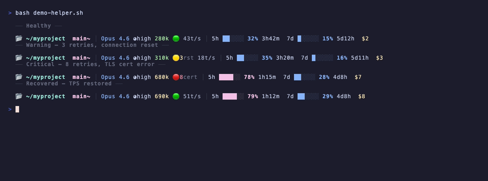

# claude-statusline

A HUD-style status line for [Claude Code](https://docs.anthropic.com/en/docs/claude-code) that turns your prompt bar into a real-time dashboard — model, context, network health, throughput, quotas, and cost, all in one line.



```
📂 ~/myproject  main~+ │ Opus 4.6 ◕high 280k 🟢 43tps │ 5h ██░░░░ 32% 3h42m  7d █░░░░░ 15% 5d12h  $2
```

> **One glance. Everything you need to know.**

---

## Why This Exists

Claude Code gives you a powerful AI pair programmer, but the default status line is... minimal. When you're deep in an Opus session burning through a Max subscription, you want to know:

- Am I about to hit the context limit?
- Is my network connection degrading?
- How fast is the API actually responding?
- How much quota have I burned? When does it reset?
- What's this session costing me?

This script answers all of that **without leaving your terminal**.

---

## Features

### 9 Modules, One Line

| Module | Display | Source |
|--------|---------|--------|
| **Directory** | `📂 ~/path` clickable | CC JSON |
| **Git Branch** | ` main~+` clickable | `git` |
| **Model** | `Opus 4.6` | CC JSON |
| **Effort** | `◔` `◑` `◕` clickable | settings.json |
| **Context** | `280k` color-coded | CC JSON |
| **Network** | 🟢🟡🔴 + error type | JSONL |
| **TPS** | `43tps` throughput | JSONL |
| **Quotas** | `5h ██░░░░ 32%` bars | CC JSON |
| **Cost** | `$2` cumulative | CC JSON |

### Network Health Monitor

Inspired by [claudebubble](https://github.com/limin112/claudebubble), but built directly into the status line. No floating window, no extra process.

The monitor reads the tail of your Claude Code session's JSONL transcript and uses **positional comparison** to determine if the session is actively retrying:

```
tail -100 session.jsonl
    ├── last "retryInMs" at line 87   ← last network error
    ├── last "stop_reason" at line 52  ← last successful response
    └── 87 > 52 → currently retrying → 🟡 or 🔴
```

| Indicator | Meaning | Action |
|-----------|---------|--------|
| 🟢 | All clear | — |
| 🟡`3rst` | 1-4 retries, ECONNRESET | Switch proxy node |
| 🟡`2cert` | 1-4 retries, TLS/certificate error | Check DNS & SSL config |
| 🔴`8` | 5+ retries | Serious connectivity issue |
| 🔴`6 504` | 5+ retries, gateway timeout | Check CDN proxy settings |

**Auto-recovery**: The indicator returns to 🟢 the instant a successful response arrives. No manual reset.

**Error classification** tags the dominant error type so you know *what to fix*:
- `rst` — Connection reset. Proxy node overloaded or ISP interference. **Switch nodes.**
- `cert` — TLS certificate verification failed. DNS resolving to wrong IP. **Fix DNS/SSL.**
- `504` — Cloudflare proxy timeout on long Opus outputs. **Use DNS-only mode.**

### Live TPS (Tokens Per Second)

Calculated from actual session data:

```
TPS = output_tokens / (response_timestamp - request_timestamp)
```

Normal ranges (through proxy):
- Opus 4.6: **35-55 tps**
- Sonnet 4.6: **80-120 tps**
- Haiku 4.5: **150-200 tps**

A sudden TPS drop (e.g., 50 → 12) signals network degradation *before* you hit full retry mode. It's the early warning that complements the 🟢🟡🔴 indicators.

### Clickable Everything (OSC 8)

Hold **Cmd** (macOS) or **Ctrl** (Linux) and click any highlighted element:

| Element | Click → | Shortcut |
|---------|---------|----------|
| `📂 ~/path` | Finder | Cmd+Click |
| ` main` | GitHub branch page | Cmd+Click |
| `◕high` | CycleEffort.app | Cmd+Click |

Requires a terminal that supports [OSC 8 hyperlinks](https://gist.github.com/egmontkob/eb114294efbcd5adb1944c9f3cb5feda): iTerm2, Kitty, WezTerm, Ghostty.

### Color System

Three-tier visual hierarchy inspired by [Starship](https://starship.rs), [Lazygit](https://github.com/jesseduffield/lazygit), and [btop](https://github.com/aristocratos/btop):

```
 Bold Bright          Normal             Dim
┌──────────────┐  ┌──────────────┐  ┌──────────────┐
│ Directory    │  │ Model name   │  │ Separators   │
│ Git branch   │  │ Progress bar │  │ Labels       │
│ Key values   │  │ Cost         │  │ Error tags   │
└──────────────┘  └──────────────┘  └──────────────┘
```

Quota progress bars use a separate scale: blue (<75%) → magenta (75-89%) → red (90%+).

Context window: green (<70%) → yellow (70-84%) → red (85%+).

---

## Installation

### Quick Start (One Command)

```bash
# Download the script
curl -o ~/.claude/statusline-command.sh \
  https://raw.githubusercontent.com/OpenClawFarm/claude-statusline/main/claude-statusline.sh

# Enable it in Claude Code
cat >> ~/.claude/settings.json << 'EOF'
{
  "statusLine": {
    "type": "command",
    "command": "bash ~/.claude/statusline-command.sh"
  }
}
EOF
```

> If you already have a `settings.json`, just add the `"statusLine"` block to it.

### Manual

1. Copy `claude-statusline.sh` to `~/.claude/statusline-command.sh`
2. Make it executable: `chmod +x ~/.claude/statusline-command.sh`
3. Add to `~/.claude/settings.json`:

```json
{
  "statusLine": {
    "type": "command",
    "command": "bash ~/.claude/statusline-command.sh"
  }
}
```

4. Restart Claude Code. The status line appears immediately.

### Requirements

- **Claude Code** v1.0.71+ (statusline support)
- **jq** — `brew install jq`
- **Python 3.9+** — for TPS calculation (pre-installed on macOS)
- **Git** — for branch display

---

## How It Works

The script receives JSON from Claude Code on stdin every ~1 second:

```json
{
  "model": { "display_name": "Claude Opus 4.6" },
  "workspace": { "current_dir": "~/project" },
  "context_window": { "remaining_percentage": 72 },
  "rate_limits": {
    "five_hour": { "used_percentage": 32, "resets_at": 1743500000 },
    "seven_day": { "used_percentage": 15, "resets_at": 1743800000 }
  },
  "cost": { "total_cost_usd": 1.5 }
}
```

For modules 1-5, 8, and 9, the script parses this JSON with `jq`.

For modules 6 (Network Health) and 7 (TPS), the script reads the session's JSONL transcript file at `~/.claude/projects/<encoded-path>/*.jsonl`. This file is written by Claude Code in real time and contains every API request, response, and error with timestamps.

### Performance Budget

| Operation | Time |
|-----------|------|
| jq parse (x6 calls) | ~20ms |
| git queries (x4, gc.auto=0) | ~15ms |
| tail + grep (network check) | ~5ms |
| python3 TPS calculation | ~30ms |
| **Total** | **~70ms** |

The status line refreshes every ~1 second. 70ms overhead is imperceptible.

---

## Customization

The script is a single bash file — edit it directly. Common tweaks:

### Change Context Window Size

```bash
# Line ~117-120: Adjust total context by model
case "$model" in
    *Opus*|*opus*) ctx_total=1000 ;;   # 1M context
    *)             ctx_total=200 ;;     # 200k context
esac
```

### Adjust Network Sensitivity

```bash
# Line ~138: Change tail depth (more lines = wider detection window)
tail_buf=$(tail -100 "$latest_log" 2>/dev/null)    # default: 100 lines

# Line ~156: Change threshold for red indicator
if [ "$retry_count" -ge 5 ]; then    # default: 5+ = red
```

### Disable Modules

Comment out any `*_part` variable and remove it from the assembly line at the bottom.

### Remove Clickable Links

Replace OSC 8 hyperlink syntax `\e]8;;URL\a...\e]8;;\a` with plain text.

---

## Terminal Compatibility

| Terminal | Full Support | Notes |
|----------|:---:|-------|
| iTerm2 | Yes | All features including OSC 8 hyperlinks |
| Kitty | Yes | |
| WezTerm | Yes | |
| Ghostty | Yes | |
| VS Code Terminal | Partial | Colors work, OSC 8 links may not |
| macOS Terminal.app | Partial | Colors work, no OSC 8 support |
| tmux | Partial | Colors work, OSC 8 requires `allow-passthrough` |

---

## Acknowledgments

- [claudebubble](https://github.com/limin112/claudebubble) by [@limin112](https://github.com/limin112) — the floating network monitor that inspired our JSONL-based health detection
- [Starship](https://starship.rs) — color conventions (cyan directories, magenta git)
- [Lazygit](https://github.com/jesseduffield/lazygit) — branch color inspiration
- [btop](https://github.com/aristocratos/btop) — HUD-style progress bar aesthetics
- Built for the [OpenClawFarm](https://github.com/OpenClawFarm) infrastructure

---

## License

[MIT](LICENSE)
